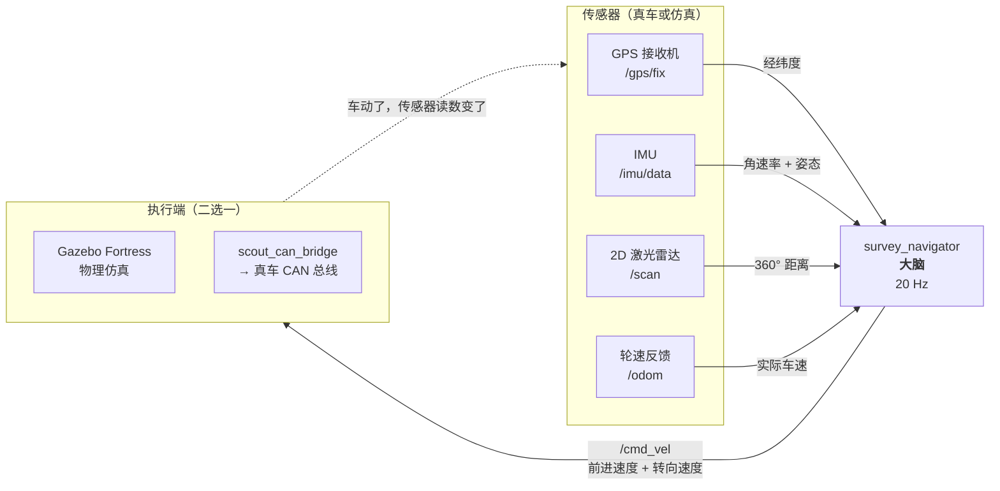
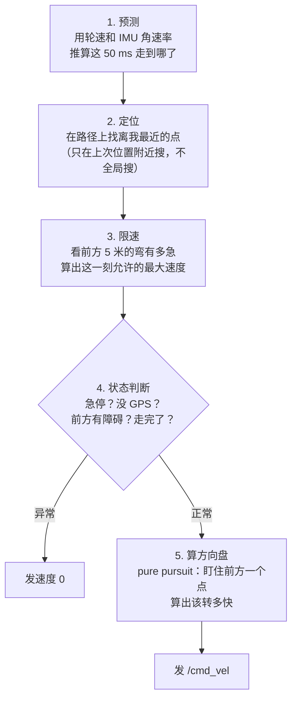

# TEMRover 导航系统 — 代码怎么组合、怎么跑起来

这份文档回答三个问题：**每个文件干什么、它们怎么串起来、专业名词是什么意思。**
配合 `research_log.zh.md`（实验记录）一起看。

---

## 一、先讲清楚 4 个 ROS 2 概念

不懂这 4 个词，后面的图看不明白。

| 词 | 大白话 | 我们项目里的例子 |
|---|---|---|
| **节点 (Node)** | 一个独立运行的小程序，负责一件事 | `survey_navigator` 是「大脑」，`scout_can_bridge` 是「翻译官」 |
| **话题 (Topic)** | 节点之间传数据的「广播频道」，一个发、多个收 | `/gps/fix` 这个频道上一直在广播当前经纬度 |
| **消息 (Message)** | 频道里传的数据格式，全 ROS 统一 | `NavSatFix` = 经纬度海拔；`Twist` = 前进速度 + 转向速度 |
| **参数 (Parameter)** | 节点启动时可以改的设置，不用改代码 | 测区多大、跑多快、线距多少，都在 `config/survey.yaml` 里 |

一句话：**节点之间不直接调用对方的函数，只往话题上扔消息。** 这样换掉任何一个节点，其他节点都不用改 —— 这就是为什么真车和仿真可以无缝切换。

---

## 二、整体数据流



**关键点：整个系统是一个闭环。** 大脑发指令 → 车动 → 传感器读数变 → 大脑再算。
Phase-1 的代码之所以不可信，就是因为它的 GPS 模拟器不听 `/cmd_vel`，自己往前爬 —— 那个环是断的，等于没测控制。

---

## 三、两种运行模式

同一个大脑 `survey_navigator`，配不同的「身体」：

| 模式 | 命令 | 身体是谁 | 用途 |
|---|---|---|---|
| 物理仿真 | `ros2 launch scout_navigation gazebo.launch.py` | Gazebo Fortress | 真实滑移、起伏地形、真实雷达回波 |
| 真车 | `ros2 launch scout_navigation hardware.launch.py` | `scout_can_bridge` | 实车（**尚未验证**） |

另外 `experiments/` 里有一套**不跑 ROS 的离线仿真**。它不是第三种运行模式，而是参数扫描工具：
跑完整趟 460 秒的测量只要几秒，Gazebo 要 8 分钟。前面那 54 组控制器对比就是它跑的。

---

## 四、逐个文件讲

### 核心库（不依赖 ROS，纯数学，可以单独测）

**`geodesy.py` — 经纬度换算成米**
GPS 给的是「南纬 37.7963 度」这种角度，但导航要算「往东走了几米」。这个文件把经纬度转成以测区起点为原点的**东-北坐标（米）**。
- 输入：经纬度 → 输出：(东 x 米, 北 y 米)
- 为什么需要：角度不能直接做加减，1 度经度在赤道是 111 km，在墨尔本只有 88 km。
- 比 Phase-1 好在哪：Phase-1 每帧算一次 haversine（球面距离公式），只能得到「距离」这一个标量；我们得到的是**向量**，才能算方向和横向偏差。

**`survey_grid.py` — 画出车要走的路线**
给定「测区 50×50 米、线距 5 米、最小转弯半径 2 米」，自动生成完整的割草机路径（一条直线走到头，掉头，回来，再掉头……），并把路径每 10 厘米采样一个点。
- 输入：测区参数 → 输出：一串路径点，每个点带「朝向」「曲率」「属于第几条测线」「是不是在掉头段」
- 为什么需要：Phase-1 是把 6 个经纬度**硬编码**在代码里的，换个测区就得改代码。
- 两种掉头见第六节。

**`path_tracking.py` — 方向盘怎么打**
车偏离路线了，该往哪打、打多少。里面有两套控制律（Stanley 和 pure pursuit）和一个限速策略（弯道自动减速，防止车斗侧翻）。
- 输入：当前位置 + 朝向 + 车速 + 路径 → 输出：转向角速度
- 为什么需要：**Phase-1 完全没有这个东西。** 它的车只会直着往前开，`angular.z` 永远是 0。±0.5 米线距精度的核心就在这里。

**`rover_model.py` — 一辆假车**
用数学描述车怎么动：给它速度指令，它按加速度上限慢慢加速，转向有滑移损失，最后算出新位置。
- 为什么需要：`experiments/` 的离线参数扫描用它当「身体」，Gazebo 用不到它。
- 里面写死了 Scout 2.0 的真实限制：最大 1.5 m/s、最大 1.5 rad/s（这是 CAN 协议的硬上限）。

**`pose_estimator.py` — 我到底在哪**
GPS 有噪声（单点定位能飘 1.5 米），IMU 的航向会慢慢漂。这个文件用**卡尔曼滤波**把三个信息源拼起来：轮速告诉你走了多远、IMU 告诉你转了多少、GPS 把累积误差拉回来。
- 输入：轮速 + IMU 角速率 + GPS 位置 + GPS 航迹角 → 输出：融合后的 (东, 北, 朝向)
- 为什么需要：单靠 GPS 位置算不出车头朝向，单靠 IMU 航向会漂到没边。

**`obstacle_monitor.py` — 前面有没有东西**
从 360° 的雷达数据里，只挑车头正前方 ±30° 的，找最近的那个距离。**并且用 IMU 的俯仰/横滚角把打到地面上的回波剔掉** —— 这是 Gazebo 里发现的坑，详见 `research_log.zh.md`。
- 输入：一帧雷达扫描 + 车身姿态 → 输出：正前方最近障碍物的距离（米）

### ROS 2 节点（会跑起来的程序）

**`survey_navigator.py` — 大脑，唯一有权发车速指令的节点**
启动时生成路径，然后每 50 毫秒（20 Hz）跑一次控制循环。内部是个状态机：

| 状态 | 什么时候进 | 在干什么 |
|---|---|---|
| `WAITING_FOR_FIX` | 还没收到 GPS | 原地不动 |
| `SURVEYING` | 正常 | 跟着路径走 |
| `HOLDING` | 前方有障碍 | 停下，等障碍消失 |
| `STOPPED` | 收到急停信号 | 停下，不再自动恢复 |
| `COMPLETE` | 走完全程 | 停车 |

> **为什么强调「唯一」**：Phase-1 有两个节点同时往 `/cmd_vel` 发指令（`integrated_navigator` 和 `grid_turn_manager`），两个都是 10 Hz，互相覆盖 —— 上车必然乱跑。

**`scout_can_bridge.py` — ROS 和真车之间的翻译官**
Scout 2.0 只认 CAN 总线，不认 ROS。这个节点把 `/cmd_vel` 翻译成 CAN 帧（ID `0x111`，每 20 毫秒发一次），再把车回传的速度反馈帧（ID `0x221`）翻译回 ROS 消息。
- ⚠️ **代码写完了，但一次都没在硬件上验证过。** 这是通往实车的唯一瓶颈。

### 仿真资产

| 文件 | 作用 |
|---|---|
| `description/temrover_sensors.xacro` | 描述雷达/IMU/GPS 天线装在车的哪个位置，参数是多少 |
| `worlds/survey_field.sdf` | Gazebo 的世界：地形、光照、障碍物、以及**经纬度原点**（GPS 仿真必须有） |
| `worlds/terrain.png` | 地形高程图，由 `experiments/make_terrain.py` 生成 |
| `config/survey.yaml` | 测区参数，两个 launch 文件共用，改这里不用重新编译 |
| `../scout_description/` | AgileX 官方的 Scout 2.0 车体模型（尺寸、质量、网格），我们改掉了它的仿真插件 |

### 实验脚本（不参与实际运行，只用来出结论）

| 文件 | 干什么 |
|---|---|
| `experiments/simulate.py` | 离线闭环仿真循环 + GPS/IMU 噪声模型 + 误差统计 |
| `experiments/run_experiments.py` | 跑 54 组对比（2 种控制器 × 3 种 GPS 等级 × 9 组增益），出图 |
| `experiments/make_terrain.py` | 按 Phase-1 地形规格生成高程图 |

---

## 五、一个控制周期（50 毫秒）里发生了什么



第 2 步的「只在附近搜」很重要：如果全局搜最近点，车在第 3 条线上时可能会突然匹配到旁边第 4 条线（只差 5 米），路径跟踪直接崩掉。

---

## 六、为什么掉头要做两种

割草机路径的难点在行末掉头。**能不能用半圆掉头，取决于线距和转弯半径的关系。**

```
情况 A：线距 ≥ 2×转弯半径          情况 B：线距 < 2×转弯半径
（我们叫 Π 形掉头）                （我们叫水滴形掉头）

  ──────────────→                   ──────────────→
                ╮                                 ╮
                │  ← 直线段补足                    ╰──╮   ← 先往反方向摆出去
                ╯                              ╭──────╯
  ←──────────────                   ←──────────────
```

- 5 米线距 → 半圆掉头的半径只能是 2.5 米。拖着 Tx/Rx 车列做不到这么小的半径。
- 转弯半径一旦大于 2.5 米，半圆就会「过冲」到隔壁线去，必须用水滴形：**先朝反方向摆出 `arccos(线距 / 2R)` 这个角度**，再一个大圆弧绕回来。
- 代价：转弯半径从 2 米放大到 4 米，总路径从 623 米变成 810 米，**测量时间多 30%**。

---

## 七、专业名词表

### 导航控制

| 名词 | 大白话 |
|---|---|
| **横向误差 (cross-track error)** | 车离规划路线有多远（垂直方向）。我们的指标是不超过 ±0.5 米 |
| **boustrophedon / 割草机路径** | 来回折返的覆盖式路径，像犁地。希腊语「牛耕地的方式」 |
| **pure pursuit（纯追踪）** | 一种跟线方法：盯住路径上前方固定距离的一个点，一直朝它开。像开车时盯着前方看 |
| **Stanley 控制器** | 另一种跟线方法：同时看「车头方向偏了多少」和「车横向偏了多少」。斯坦福赢 DARPA 挑战赛的车用的 |
| **曲率 (curvature)** | 弯的急不急，等于转弯半径的倒数。半径 2 米 → 曲率 0.5 |
| **前视距离 (lookahead)** | pure pursuit 盯着的那个点有多远。太近会画龙，太远会切弯 |
| **状态机 (state machine)** | 程序在任意时刻只处于一个明确状态，按规则跳转。避免「一边避障一边导航」这种矛盾行为 |

### 定位与传感器

| 名词 | 大白话 |
|---|---|
| **EKF（扩展卡尔曼滤波）** | 把多个都不准的测量融合成一个更准的估计，并且知道自己有多不确定 |
| **航位推算 (dead reckoning)** | 靠「走了多快 × 走了多久 + 转了多少」纯累加算位置。短期准，长期越飘越远 |
| **RTK** | 差分 GPS，靠一个已知位置的基站发改正数，精度从米级提到厘米级 |
| **SBAS** | 卫星广播的粗改正，精度大概 0.3–0.7 米，不用自己架基站 |
| **单点定位 (standalone)** | 什么改正都不用，精度 1–2 米。我们买的 NEO-M9N 默认就是这个 |
| **IMU 漂移** | 陀螺仪算航向是靠角速度累加的，一点点误差累积下去，几分钟就能偏好几度 |
| **航迹角 (course over ground)** | GPS 根据你的移动方向算出的朝向。车不动时完全没用，所以代码里设了最小速度门限 |
| **里程计 (odometry)** | 由轮子转速推算的位置和速度 |

### 车与总线

| 名词 | 大白话 |
|---|---|
| **skid steer（滑移转向）** | 左右轮差速转向，没有方向盘，转弯时轮子必然打滑。坦克、Scout 都是这种 |
| **CAN 总线** | 汽车/工业设备用的通信线，抗干扰强。Scout 2.0 只认这个 |
| **SocketCAN** | Linux 把 CAN 当网卡用的机制，`ip link set can0 up` 就能开 |
| **CAN 帧 ID** | 每种消息有个编号。`0x111` = 发给车的速度指令，`0x221` = 车回传的实际速度 |
| **命令控制模式** | Scout 的遥控器上有个 S1 开关，拨到顶车才接受 CAN 指令，否则只听遥控器 |

### 仿真

| 名词 | 大白话 |
|---|---|
| **URDF / xacro** | 描述机器人长什么样的 XML 文件（有几个连杆、关节在哪、多重）。xacro 是带变量和宏的 URDF |
| **SDF** | Gazebo 描述整个世界的格式（地形、光照、物理参数） |
| **heightmap（高程图）** | 一张灰度图，像素越亮地形越高。Gazebo 拿它生成地形。Fortress 只吃 8 位图 |
| **ISO 8608** | 路面粗糙度的国际标准分级，Class A 最平（高速公路）到 Class E 最糙（乱石地）。Royal Park 大概是 Class C |
| **ros_gz_bridge** | Gazebo 和 ROS 2 用的是两套不同的消息格式，这个程序在中间做双向翻译 |
| **TF** | ROS 里描述「哪个坐标系相对哪个坐标系在什么位置」的机制 |

---

## 八、现在什么状态

| 部分 | 状态 |
|---|---|
| 路径生成 | ✅ 几何已验证：曲率精确等于 1/R，线距误差 <1 毫米 |
| 跟线控制 | ✅ 平地仿真 RTK 下横向误差 rms 0.018 米，远优于 0.5 米指标 |
| 位姿融合 | ✅ 仿真里估计值与真值完全重合 |
| 障碍检测 | 🔶 只会停不会绕；地面误检已修但安装方案没定 |
| 物理仿真 | 🔶 起伏地形上只跑了 14 米，还没跑完整条测线 |
| 真车 CAN | ❌ 代码写完，**零验证** |

**已经能下的结论：**
1. **必须上 RTK。** 单点 NEO-M9N 横向误差最大 1.5 米，超标 3 倍。这是采购决策。
2. **5 米线距下半圆掉头不成立**，必须用水滴形，测量时间要多算 30%。
3. **2D 雷达在起伏地形上会把地面当障碍物**，纯平地仿真永远发现不了。

---

## 九、接下来做什么

| 优先级 | 事情 | 为什么 | 大概工作量 |
|---|---|---|---|
| 1 | 用 `vcan0`（虚拟 CAN）对拍帧格式 | 不需要实车就能验证字节序和帧结构，是通往硬件的唯一瓶颈 | 半小时 |
| 2 | Gazebo 跑完整 50×50 米 | 真实滑移下能不能守住 ±0.5 米，目前只有 14 米的证据 | 一次运行 + 出图 |
| 3 | 雷达安装角度对比（装平 vs 上仰 3°/5°） | 地面误检的根治方案，影响硬件安装 | 半天 |
| 4 | 把 `robot_localization` 换掉自写 EKF | 标准件，写论文好交代 | 半天 |
| 5 | 障碍绕行重规划 | 8/19 纪要升级成 Must-have 了 | 需要先定方案 |

同时**没在代码里、但你名下的事**：
- 读 S2L / NEO-M9N / ICM-20948 三份手册（Gantt 上 08-24 → 08-26）
- 约 Hashan 和 Sumit 的 Autonomous Work Day —— CAN 接线和遥控器模式这些坑，当面问比自己试快得多
