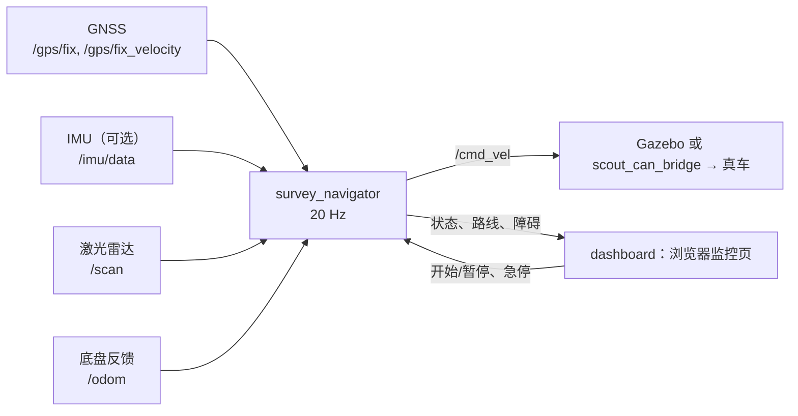

# TEMRover 导航系统：每个文件干什么、怎么串起来

配合 `research_log.zh.md`（实验记录）一起看。

## 一、四个 ROS 2 概念

| 词 | 大白话 | 项目里的例子 |
|---|---|---|
| 节点 (Node) | 一个独立运行的小程序 | `survey_navigator` 是大脑，`scout_can_bridge` 是翻译官 |
| 话题 (Topic) | 节点之间广播数据的频道 | `/gps/fix` 一直在广播当前经纬度 |
| 消息 (Message) | 频道里的数据格式 | `NavSatFix` = 经纬度；`Twist` = 前进速度 + 转向速度 |
| 参数 (Parameter) | 启动时可改的设置 | 测区、速度、避障距离都在 `config/*.yaml` |

## 二、整体数据流

```mermaid
flowchart LR
    GPS["GNSS<br/>/gps/fix, /gps/fix_velocity"] --> NAV
    IMU["IMU（可选）<br/>/imu/data"] --> NAV
    LID["激光雷达<br/>/scan"] --> NAV
    ODO["底盘反馈<br/>/odom"] --> NAV
    NAV["survey_navigator<br/>20 Hz"] -->|/cmd_vel| BODY["Gazebo 或 scout_can_bridge → 真车"]
    NAV -->|状态、路线、障碍| WEB["dashboard：浏览器监控页"]
    WEB -->|开始/暂停、急停| NAV
```

同一个导航节点，配 Gazebo 就是仿真，配 CAN 桥就是真车。

## 三、运行方式

一个实验一条命令（在 `scout_navigation/` 目录下）：

| 场景 | 命令 |
|---|---|
| 真车 | `./run.sh field site:=field_today.yaml`：GNSS、激光、IMU、相机、导航、CAN 桥、监控页一起起 |
| 仿真 | `./run.sh sim`：Gazebo + 七个障碍物 + 监控页 |

监控页：浏览器开 `http://<车的IP>:8000`。底下的 `field.launch.py` / `sim.launch.py` 由 `run.sh` 调用，
单独的 `gazebo`、`hardware`、`dashboard` 三个 launch 也还能各自用。

## 四、核心代码 `scout_navigation/`

| 文件 | 干什么 |
|---|---|
| `survey_navigator.py` | 大脑，唯一发 `/cmd_vel` 的节点。对准、跑测线、转弯、避障、暂停、急停，以及给监控页发状态 |
| `pose_estimator.py` | EKF：轮速 + 偏航率预测，GNSS 位置和航迹角修正，含天线杆臂 |
| `obstacle_monitor.py` | 激光数据处理：去地面、去坡面、只留前方 60° 扇区、转到世界坐标 |
| `detour.py` | 绕行几何：选边、只看最近一组障碍、按侧向加速度算坡道长度、绕完马上回线 |
| `survey_grid.py` | 生成测线任务：不挂拖车是直线 + 原地转 90°；挂拖车是每条线两头各多开一段，再接 U 型弯（Π 形或水滴形） |
| `geodesy.py` | 经纬度 ↔ 东北坐标（米） |
| `scout_can_bridge.py` | `/cmd_vel` ↔ Scout 2.0 CAN 帧；0.5 s 收不到指令自动停车 |
| `imu_driver.py` | 读 ICM-20948（改自 ej5962/Capstone），开机静止 3 s 测陀螺零偏后发 `imu/data` |

**状态机**（`survey_navigator.py`）

| 状态 | 含义 |
|---|---|
| `WAITING_FOR_FIX` | 等 GNSS 定位 |
| `ALIGNING` | 直行 8 m 求初始航向 |
| `SURVEYING` | 跑测线，遇障自动绕 |
| `TURNING` | 线尾原地转 90°（只用于不挂拖车） |
| `HEADLAND` | 挂拖车时线尾不停车，直接沿 U 型弯开到下一条线 |
| `HOLDING` | 前方 1 m 内堵住，停车等 |
| `STOPPED` | 急停；清除后从第 1 条线重来 |
| `LOST` | 偏离测线超过 3 m，停车 |
| `COMPLETE` | 走完 |

模式（页面按钮）：`idle` 暂停保留进度，`autonomous` 继续，`manual` 交给遥控节点。

## 五、配置 `config/`

| 文件 | 内容 |
|---|---|
| `survey.yaml` | 所有默认参数：速度、避障距离、激光安装、滤波噪声 |
| `field_today.yaml` | 短测量现场模板：起点坐标、方向、线数、雷达朝后 |
| `south_lawn.yaml` | 南草坪 30 × 30 m 测区（MGA55 测量点） |
| `payload.yaml` | 拖车几何（PVC 连杆中点铰接）、U 型弯半径 6 m、线两头多开 8 m |
| `ublox_rover.yaml` | ZED-F9P 驱动：只读不改接收机配置，发 `gps/fix`、`gps/fix_velocity` |
| `obstacles.yaml` | 仿真里的 7 个测试障碍物 |
| `survey.rviz` | rviz 视图 |

## 六、其他目录

| 目录 | 内容 |
|---|---|
| `launch/` | `field` / `sim` 两个总 launch，加 `gazebo`、`hardware`、`dashboard` 三个分 launch |
| `web/` | 监控页（`index.html`）和本地 roslib |
| `description/` | 车上的雷达、IMU、天线、相机、拖车模型 |
| `worlds/` | Gazebo 场地、障碍物、地面测线标记 |
| `experiments/` | 工具脚本，见下表 |
| `results/` | 图和视频 |
| `../scout_description/` | AgileX 官方 Scout 2.0 车体模型 |

**`experiments/` 工具脚本**

| 文件 | 用途 |
|---|---|
| `detour_run.py` | 仿真七障碍测试，打分并出图 |
| `compare_planners.py` | 两次跑的轨迹叠图对比 |
| `record_video.py` / `compose_video.py` | 录俯视视频、两段并排 |
| `make_avoidance_figures.py` | 避障原理示意图 1–4 |
| `make_path_marker.py` / `make_terrain.py` | 生成 Gazebo 测线标记和起伏地形 |
| `turn_design.py` | 拖车运动学：按铰接几何选 U 型弯半径和线两头的延长距离 |
| `bench_scan.py` | 车架空时用的假激光，台架测试绕行 |
| `can_loopback_test.py` | 虚拟 CAN 上测 CAN 桥 |
| `rover_nudge.py` / `spin_test.py` | 实车直行、原地转的标定 |
| `survey_config.py` | 给上面脚本读配置 |

## 七、名词表

| 名词 | 大白话 |
|---|---|
| 横向误差 (cross-track) | 车离测线的垂直距离，指标 ±0.5 m |
| 割草机路径 (boustrophedon) | 来回折返覆盖测区 |
| EKF | 把几个都不准的测量融合成更准的估计 |
| 航位推算 (dead reckoning) | 没有 IMU 时用底盘偏航率积分航向 |
| RTK | 差分 GNSS，厘米级；我们用手机热点收 NTRIP 改正 |
| 杆臂 (lever arm) | 天线不在车中心，车一转天线就甩，要扣掉 |
| 通道 (corridor) | 车会扫过的条带，中心线左右各 0.65 m |
